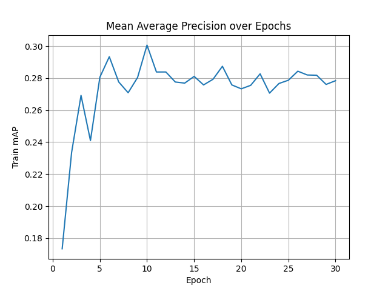

# NYCU Computer Vision 2025 Spring HW3

## Student Information
**Student ID**: 111550150
**Name**: 俞祺譯

## Introduction
This repository implements an **instance segmentation pipeline** using **Mask R-CNN with a ResNet50-FPN v2 backbone** to segment and classify cell instances from colored medical images. The model detects multiple classes of cells (class1–class4) at the instance level and outputs results in COCO-style format.

## Features
- Mask R-CNN with ResNet50-FPN v2 backbone for instance segmentation
- Custom dataset loader that processes multiple `.tif` mask files per class
- Tracks training loss and validation mAP using TensorBoard
- Custom anchor generator to better detect small objects
- Automatic generation of detection results in JSON for submission

## How to Install
### Prerequisites
Ensure the following are installed:
- Python 3.8+
- PyTorch (with GPU support)
- COCO API
- TensorBoard
- scikit-image, NumPy, Matplotlib, TQDM

### Installation Steps
```bash
# Clone the repository
git clone https://github.com/ianthefish/Visual-Recognition-MaskRCNN.git
cd Visual-Recognition-MaskRCNN

# Install dependencies
pip install -r requirements.txt

# Run the code
python model.py
```

## Dataset Setup
Prepare the dataset in the following directory structure:
```
hw3-data-release/
├── train/
│   ├── <sample_1>/
│   │   ├── image.tif
│   │   ├── class1.tif
│   │   ├── class2.tif
│   │   ├── class3.tif
│   │   └── class4.tif
│   ├── <sample_2>/
│   │   └── ...
├── test_release/
│   ├── image1.tif
│   ├── image2.tif
│   └── ...
├── test_image_name_to_ids.json
```
- Each train/<sample>/ folder contains the main image and its corresponding mask files for each class (class1–class4).

- The test_image_name_to_ids.json file provides mappings from test image filenames to their image IDs (used for JSON submission formatting).

## Performance Snapshot

<p align="center">
    
    
</p>

The final Highest Val mAP is **0.3006**.